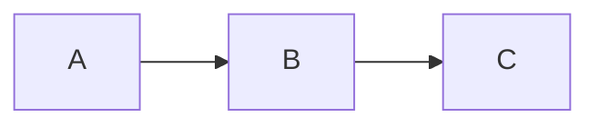

# Templates

## Spec File Template

```markdown
# NN.NN Spec Name

> **Feature Area:** [[../README|NN-Feature-Area-Name]]
> **Feature ID:** NN.NN
> **Ticket:** tk-000 (optional)

## Behavior

### Contract
- **Input:** description
- **Output:** description
- **Preconditions:** what must be true before
- **Postconditions:** what will be true after

### Scenarios
- When X happens → Y should occur
- When edge case → handle gracefully

## Decisions

### Assumptions
1. [Assumption] - [implication if wrong]
2. [Assumption] - [implication if wrong]

### Failure Modes
| Failure | Detection | Recovery |
|---------|-----------|----------|
| [scenario] | [how to detect] | [what to do] |

### ADR-1: Decision Title
- **Status:** Proposed | Accepted | Deprecated | Superseded
- **Context:** Why this decision was needed
- **Decision:** What we decided
- **Consequences:** What happens as a result
- **Alternatives:** What we considered and rejected

### Open Questions

%% 🤖 Question needing resolution? %% ^q-specname-topic

## Integration

### Dependencies
- [[path/to/spec|Display Name]] - what we need from it

### Consumers
- [[path/to/spec|Display Name]] - what uses us

### Diagram

```

## Plan File Template

```markdown
# NN.NN Plan Name

> **Feature Area:** [[../README|NN-Feature-Area-Name]]
> **Related Spec:** [[NN.NN-spec-name]] (optional)
> **Ticket:** tk-000 (optional)

## Goal
What this plan achieves.

## Prerequisites
- [ ] Dependency 1
- [ ] Dependency 2

## Implementation Steps

### Phase 1: [Name]
- [ ] Step 1
- [ ] Step 2

### Phase 2: [Name]
- [ ] Step 3
- [ ] Step 4

## Files to Modify
| File | Changes |
|------|---------|
| `path/to/file` | Description of changes |

## Testing Strategy
How to verify the implementation works.

## Risks & Mitigations
| Risk | Mitigation |
|------|------------|
| [What could go wrong] | [How to prevent/handle] |

## Open Questions

%% 🤖 Implementation question? %% ^q-planname-topic
```

## Bulletproof Plan Guidelines (Agent-Proof)

Plans are executed by agents that take everything literally. Ambiguity causes expensive mistakes. Use these rules to make plans unambiguous and self-checking.

**Rule 1: Naming consistency (CRITICAL)**
- Pick ONE name for each new type/table/function/file and use it everywhere.
- If you rename during planning, update the entire doc (do not leave old names around).

**Rule 2: Migration semantics (CRITICAL)**
- For any new thing that overlaps an existing thing, explicitly state one of:
  - REPLACES (old is removed)
  - EXTENDS (old stays, new adds behavior)
  - COEXISTS WITH (both exist; explain selection rules)

**Rule 3: State transitions (CRITICAL)**
- For every boolean/enum state, document ALL transitions:
  - trigger condition
  - which system/reducer executes it
  - side effects (what else changes)

**Rule 4: Ownership (CRITICAL)**
- If touching shared state (DB rows, physics-owned state, caches), state WHO OWNS IT and HOW it may be modified.
- Include a guardrail: "NEVER mutate X directly; always go through Y".

**Rule 5: Error paths (required)**
- List failure conditions and required cleanup/rollback for each.

**Rule 6: Concrete file list (required)**
- List EVERY file to create/modify/delete.
- For modified files: list the exact functions to change and what changes.

**Rule 7: Tests (required)**
- Name test cases, describe assertions, and specify file locations.

**Rule 8: Danger Dragons (required)**
- Add an explicit "how it should NOT work" section listing common mistakes.
- Include the WHY (what breaks / what incident it prevents).

**Plan checklist (before execution):**
- [ ] Terminology section exists and is consistent
- [ ] Migration semantics stated for every overlapping construct
- [ ] State transition table exists for every state field
- [ ] Error paths listed
- [ ] File list is complete
- [ ] Test cases are named
- [ ] Danger Dragons section exists

**Suggested plan add-ons (drop into any plan):**

```markdown
## Terminology
- `ThingA`: definition
- `ThingB`: definition

## Migration
- `OldThing` is REPLACED by `NewThing`.
- References to `OldThing` are updated in: `path/a`, `path/b`.

## State Transitions
| From | To | Trigger | Owner/System | Side Effects |
|------|----|---------|--------------|--------------|
| ...  | ...| ...     | ...          | ...          |

## Error Paths
| Condition | Detection | Response | Cleanup |
|----------|-----------|----------|---------|

## Danger Dragons (How it should NOT work)
- ❌ Don't do X
  - WHY: breaks Y
```

## Feature Area README Template

```markdown
# NN Feature Area Name

> Brief description of what this feature area covers.

## Goal
What this feature area achieves.

## Specs

| Spec | Description | Status |
|------|-------------|--------|
| [[NN.NN-spec-name]] | Brief description | Status |

## Plans

| Plan | Description | Status |
|------|-------------|--------|
| [[NN.NN-plan-name]] | Implementation approach | Status |

## Shared Decisions

ADRs that apply to all specs in this feature area:
- **Decision:** Brief summary

## Integration Points

This feature area connects to:
- [[../20-other-area/README|Other Feature Area]] - how
```

## AGENTS.md Setup (Symlink)

AGENTS.md should be a **symlink** to AGENTS.md, not a file with content:

```bash
# From within docs/ directory
ln -s AGENTS.md AGENTS.md
```

This ensures AGENTS.md and AGENTS.md always have identical content. All actual instructions go in AGENTS.md.

## AGENTS.md Template

Agent instructions belong here:

```markdown
# Agent Instructions: [Project Name]

[Project-specific rules here...]

## 00.00 Johnny Lookup

If the human gives you simply an ID like `20.01` (or `2001`), treat it as a **handbook call**.

- Locate and read the matching handbook doc: `docs/handbook/**/20.01-*.md`
- Follow the instructions literally.
- If multiple matches exist, list them and pick the most relevant by context.

---

## Wiki Operations

**IMPORTANT:** When working with this wiki, use the `obsidian-plan-wiki` skill if available. It provides the full spec format and workflow patterns.

This documentation uses Obsidian vault format. Follow these patterns.

### Change Tracking (No LWW)

Specs, plans, and code are updated intentionally and together. Track changes via `tk` tickets and `tinychange` entries.

### Ticketing (tk)

All non-trivial work is tracked via `tk` (https://github.com/wedow/ticket).

**Small-change exemption** (all must be true): one file, ≤10 lines, docs-only or comment/typo-only. Otherwise, create a ticket.

Oneshot: `ID=$(tk create "Description" -t task -p 1 --tags tag1,tag2 -d "Details") && tk start $ID && printf '\n## Goal\n...\n' >> .tickets/$ID.md`

Lifecycle: `tk create` → `tk start <id>` → work → `tk close <id>` → commit.

Include ticket IDs in spec/plan headers and in `tinychange` messages.

When logging changes: `tinychange -I new -k <fix|feat|docs|refactor|...> -m "t-XXXX: message" -a AUTHOR`

### Progressive Disclosure

**Don't load everything.** Navigate in layers:

1. **Start at feature area README** - `features/NN-name/README.md`
   - Understand scope and current status
   - See which specs exist

2. **Read specific specs as needed** - `features/NN-name/NN.NN-*-spec.md`
   - Load only the spec you're implementing
   - Check "Integration" section for related specs

3. **Dive into reference docs for deep context** - `reference/` or `features/NN-name/reference/`

4. **Check research for background** - `research/topic/`

### Johnny Decimal Features

Feature areas use Johnny Decimal IDs with two-digit decimals. Specs/plans use `NN.NN-` prefixes.

### Open Questions System

See [[handbook/10-docs/10.01-open-questions-system]] for full spec.

**WHO ANSWERS WHAT:**
| Emoji | Who wrote it | Who should answer/action |
|-------|--------------|--------------------------|
| 🙋‍♂️ | Human | **Agent** (this is work for you!) |
| 🤖 | Agent | **Human** (skip this, you asked it) |
| ✅ | Resolved | **No one** |

### Updating Specs

**Before:** Read Assumptions and Failure Modes
**During:** Mark open questions resolved with `✅`, note discoveries
**After:** Update Success Criteria checkboxes, update README status

### Link Format

| Target | Format |
|--------|--------|
| Same directory | `[text](filename.md)` |
| Parent | `[text](../README.md)` |
| Cross-feature area | `[text](../20-name/README.md)` |
```

## Codebase AGENTS.md

Every top-level code or source folder must include an `AGENTS.md` that explains:
- The folder's purpose
- Feature area IDs it implements (link to `docs/features/`)
- Boundaries (what does NOT belong here)
- Primary entry points and tests

**Recommended AGENTS.md files for docs/ subfolders:**

| Path | Content |
|------|---------|
| `docs/reference/AGENTS.md` | Purpose, Johnny Decimal convention, citation rules |
| `docs/plans/AGENTS.md` | Purpose, naming convention (`YYYY-MM-DD-HHMM-topic.md`), plan quality rules |
| Postmortem tickets (tagged `postmortem`) | Purpose, incident learnings |
| `docs/handbook/AGENTS.md` | Purpose, Johnny Decimal areas, update rules |

**Referencing postmortems from code AGENTS.md:**

When a past incident is relevant to a code folder, link the postmortem directly in that folder's AGENTS.md so agents encounter the lesson at the point of danger:

```markdown
> **Post-mortem:** See postmortem ticket — Brief description of what went wrong.
```

## Root README Template

```markdown
# Project Wiki

> **For Claude:** Start here. Read feature area READMEs for context, then specific specs as needed.

## Feature Areas

| # | Feature Area | Description |
|---|--------------|-------------|
| 10 | [[features/10-name/README\|Name]] | Description |

## Quick Links

- [[AGENTS]] - Rules for agents
- [[changelog]] - What changed and when
- [[handbook/README]] - Process and tooling handbook
- [[reference/architecture]] - System overview
- [[reference/decisions]] - ADRs

## Postmortems

Incident learnings (read these before repeating known mistakes):
- Postmortem tickets (tagged `postmortem`) - Description

## Research

Oracle/Delphi outputs (frozen snapshots):
- [[research/topic]] - Description
```
